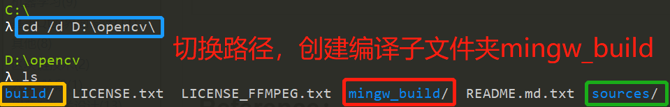
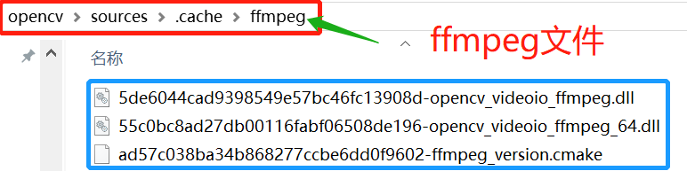
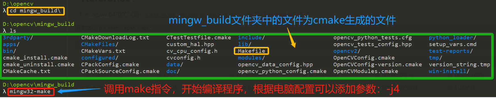
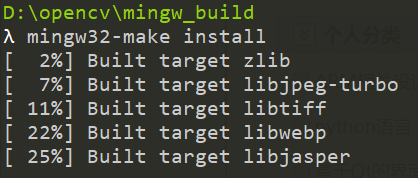

# OpenCV

## 安装（vscode + mingw + cmake）

- [opencv-4.2.0-vc14_vc15.exe](https://sourceforge.net/projects/opencvlibrary/files/4.2.0/opencv-4.2.0-vc14_vc15.exe/download)
- [x86_64-8.1.0-release-posix-sjlj-rt_v6-rev0.7z](https://sourceforge.net/projects/mingw-w64/files/Toolchains%20targetting%20Win64/Personal%20Builds/mingw-builds/8.1.0/threads-posix/sjlj/x86_64-8.1.0-release-posix-sjlj-rt_v6-rev0.7z)
  - <https://sourceforge.net/projects/mingw-w64/files/mingw-w64/mingw-w64-release/>
- [cmake-3.17.2-win64-x64.msi](https://github.com/Kitware/CMake/releases/download/v3.17.2/cmake-3.17.2-win64-x64.msi)

0. <https://www.cnblogs.com/uestc-mm/p/12758110.html>
1. 切换到Opencv目录下(Source旁边)，并新建编译文件夹

    
2. 打开CMake软件，设置相关编译参数。 配置 opencv的源代码路径以及编译文件夹，点击Configure即可触发配置，第一次配置需要输入编译器类型以及Makefile类型

    
3. 使用的是MinGW的编译方式，需要生成的是MinGW Makefile，编译器由我们自己来指定-->Next

    
4. 点击Next之后，就需要我们选择C编译器以及C++编译器的绝对路径

    
5. 在这里如果没有配置OpenCV源文件中的ffmpeg文件，则会出现报错信息：opencv_ffmpeg.dll等下载失败。
 解决办法如下：根据报错信息提供的相关文件的下载地址，手动下载相关文件到OpenCV源代码的ffmpeg文件夹中

    
配置完基本选项之后即可点击Generate开始生成MinGW Makefile
6. 开始编译OpenCV源代码

    
7. 建立目标，准备安装

    

## Demo

```cpp
#include <stdio.h>
#include <iostream>
#include <stdlib.h>
#include <opencv2/opencv.hpp>
using namespace std;
// libopencv_core420

int main()
{
  cv::Mat a = cv::imread("C:\\Users\\klein.zhou\\Desktop\\practice\\opencv\\webgl24glb.jpg"); // cv::imread => libopencv_imgcodecs420
  cv::imshow("OpenCV Demo",a); // cv::imshow => libopencv_highgui420
  cv::waitKey(0); // cv::waitKey => libopencv_highgui420
  return 0;
}
```

- 路径与库
  - -ID:/software/opencv/mingw/install/include
  - -LD:/software/opencv/mingw/install/x64/mingw/lib
  - -llibopencv_core420
  - -llibopencv_highgui420
  - -llibopencv_imgcodecs420
  - -llibopencv_imgproc420

- vscode 生成项目
  - vscode 安装扩展 C/C++ Project Generator，生成一个项目
  - 在 .vscode 文件夹中添加文件 c_cpp_properties.json，将 openCV 的相关路径（`D:/software/opencv/mingw/install/include`）配置到 includePath 中（`非必需`）

- shell 执行
  - g++ -std=c++17 -Wall -Wextra -g -Iinclude -ID:/software/opencv/mingw/install/include -c src/main.cpp -o src/main.o  -LD:/software/opencv/mingw/install/x64/mingw/lib -llibopencv_imgcodecs420 -llibopencv_imgproc420 -llibopencv_highgui420 -llibopencv_core420
  - g++ -std=c++17 -Wall -Wextra -g -Iinclude -ID:/software/opencv/mingw/install/include -o output\main.exe src/main.o  -LD:/software/opencv/mingw/install/x64/mingw/lib -llibopencv_imgcodecs420 -llibopencv_imgproc420 -llibopencv_highgui420 -llibopencv_core420

- vscode c/c++ 环境执行
  - tasks.json 中 args 数组里添加必要的参数
  - 到入口页面点击右侧的三角形，run/build 代码

- mingw 执行
  - 修改 `INCLUDE := include D:/software/opencv/mingw/install/include`
  - 修改 `LIB  := lib D:/software/opencv/mingw/install/x64/mingw/lib`
  - 增加
    - `LINKLIB := libopencv_core420 libopencv_highgui420 libopencv_imgcodecs420 libopencv_imgproc420`
    - `LINKLIBFILES := $(LINKLIB)`
    - `LINKLIBS	:= $(patsubst %,-l%, $(LINKLIBFILES:%/=%))`
  - 修改 `$(CXX) $(CXXFLAGS) $(INCLUDES) -o $(OUTPUTMAIN) $(OBJECTS) $(LFLAGS) $(LIBS) $(LINKLIBS)`

### 问题

- undefined reference to `cv::imread(std::__cxx11::basic_string\<char, std::char_traits\<char>, std::allocator\<char> > const&, int)
  - 未引入 libopencv_imgcodecs420 库

- 由于找不到 libopencv_imgcodecs420.dll，无法继续执行代码
  - 添加环境变量 path => D:\software\opencv\mingw\install\x64\mingw\bin

## 基本操作

- cv::waitKey() 键盘绑定函数，等待任何键盘事件指定的毫秒。其参数是以毫秒为单位的时间
- cv::destroyAllWindows() 销毁所有窗口
- cv::destroyWindow() 销毁特定的窗口，确切的窗口名称作为参数
- cv.namedWindow('image'，cv.WINDOW_NORMAL) 创建空窗口

### 图像

- Mat vc::imread - 读
  - cv::imread("webgl24glb.jpg", cv::IMREAD_UNCHANGED);
- vc::imwrite - 写
  - cv::imwrite("save.png", img);
- vc::imshow - 展示
  - cv::imshow("image", img);

### 视频

- cv::VideoCapture
- cap.isOpened() - 是否打开成功
- cap.release()

- 从相机中读取视频
- 从文件播放视频
  - cv::VideoCapture("last.mp4")
  - 获取帧
    - cap.read(frame)
    - cap>>frame
  - 是否为空帧 - frame.empty()
